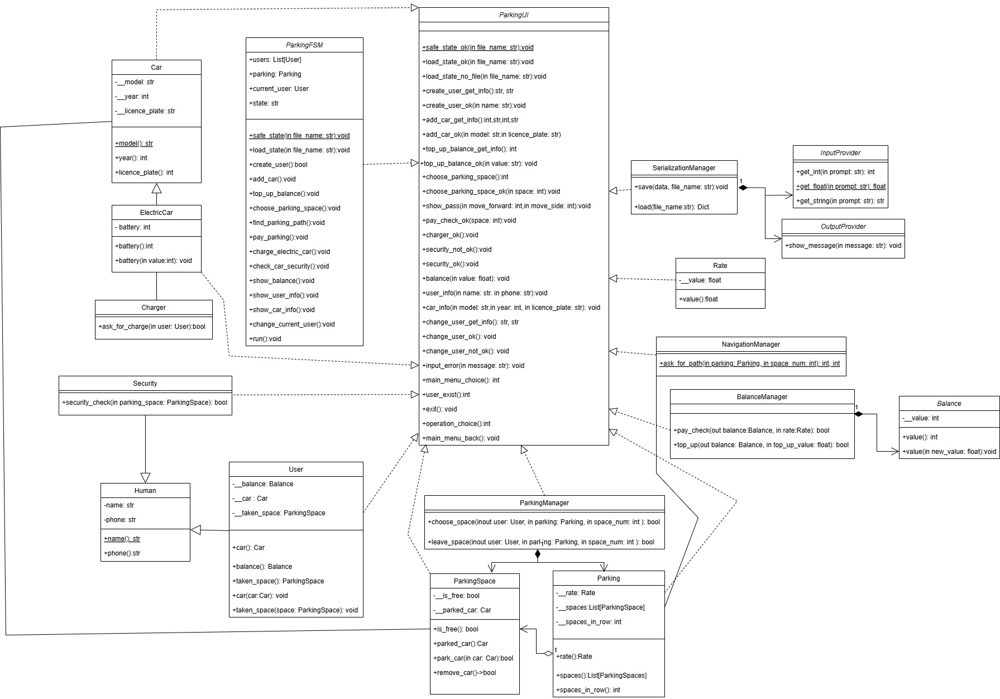
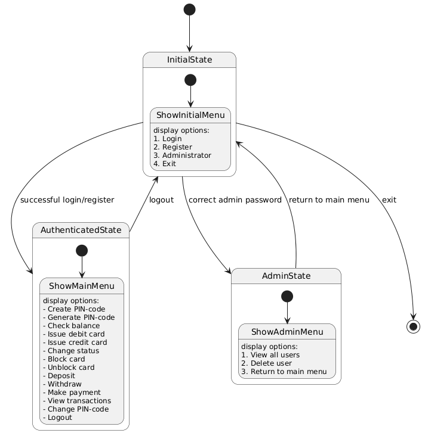

#Модель автостоянки
==================================
## *Главные сущности*
- ### *Balance* 
- ### *User*
- ### *Car*
- ### *Interface*
- ### *ParkingSpace*
- ### *Rate*
- ### *Security*
- ### *ParkingManager*

## Interface

### **Реализует основные операции взаимодействия с пользователем. Хранит все переменные, требуемые для работы программы.**

### Методы

- `safe_state` - сохраняет состояние программы в файл .pkl.

- `load_state` - загружает состояние программы из файла .pkl.

- `create_user` - создает пользователя с введенными данными.

- `add_car` - добавляет машину с введенными данными текущему пользователю.

- `top_up_balance` - пополняет баланс текущего пользователя на введенную сумму.

- `choose_parking_space` - пользователь выбирает место, если это место свободно, машина паркуется на него.

- `find_parking_path` - выводит информацию, как добраться до парковочного места.

- `pay_parking` - пользователь оплачивает парковку и покидает место

- `charge_electric_car` - заряжает электромобиль пользователя.

- `check_car_security` - проверка сохранности автомобиля.

- `show_balance` - показывает текущий баланс пользователя.

- `show_user_info` - показывает имя и телефон пользователя.

- `show_car_info` - показывает информацию об автомобиле пользователя.

- `сhange_current_user` - изменяет текущего пользователя.

- `run` - запускает интерфейс.

--------------------------------------

## BalanceManager

### **Реализация всех операций с балансом пользователя**
### Основные методы

- `top_up` - увеличивает баланс на определенную сумму.

- `pay_check` - уменьшает баланс на парковочный тариф.

--------------------------------------

## Charger

### **Реализация операции зарядки электромобиля**
### Основные методы

- `ask_for_charge` - изменяет значение заряда на 100%.

--------------------------------------

## NavigationManager

### **Реализация операции движения на парковке**
### Основные методы

- `ask_for_path` - находит расстояние которое нужно проехать и направление пути.

--------------------------------------

## ParkingManager

### **Реализация взаиможействия пользователя и парковки**
### Основные методы

- `choose_space` - метод выбора места.

- `leave_space` - метод освобождения места пользователем.

# Диаграммы 

