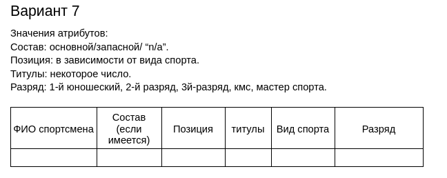
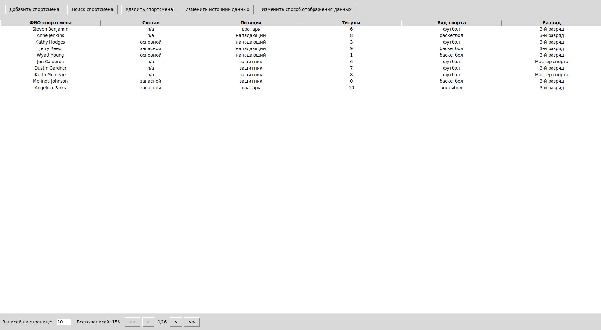
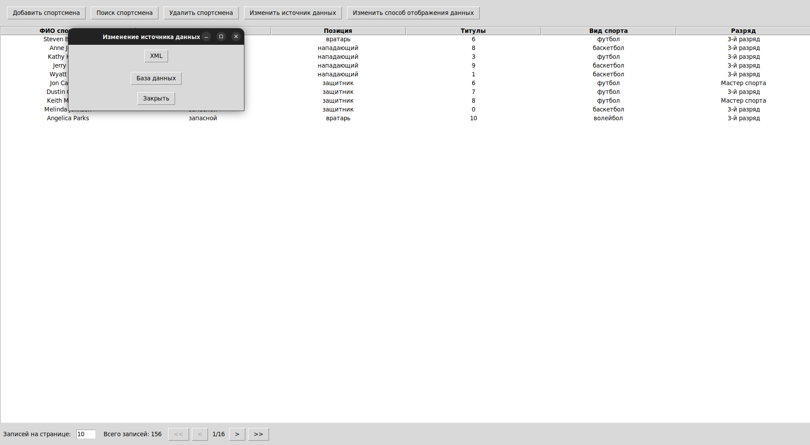
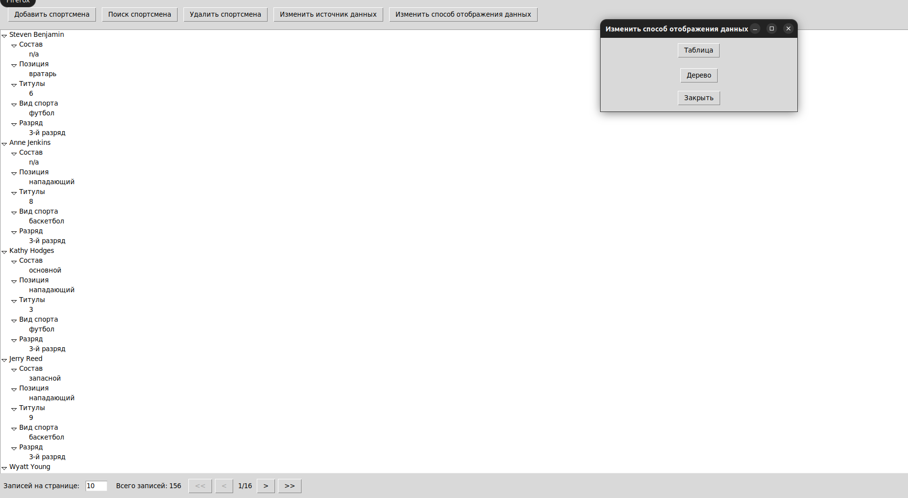
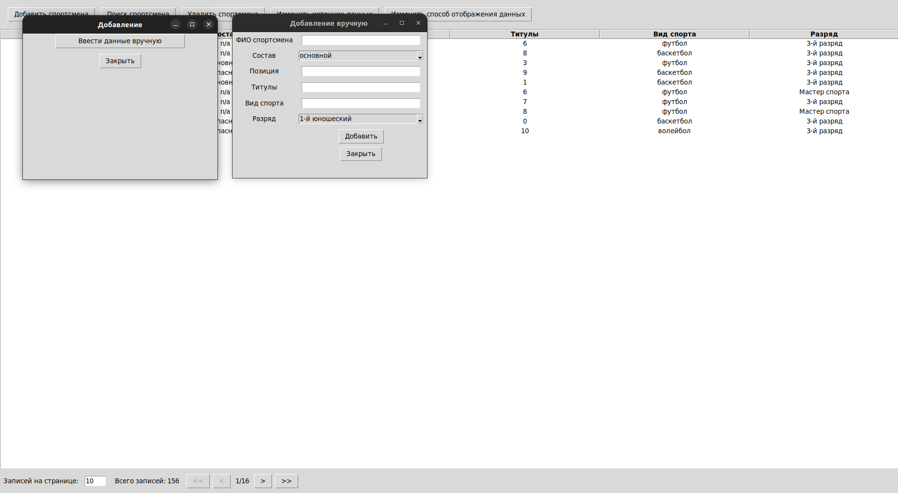
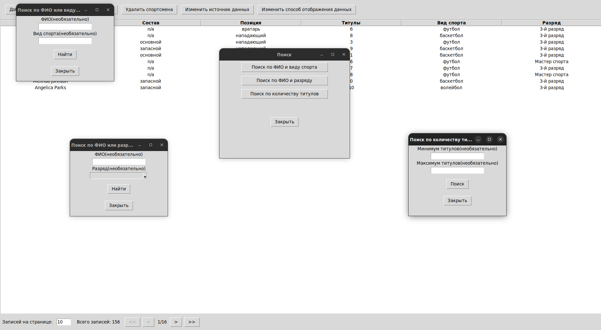
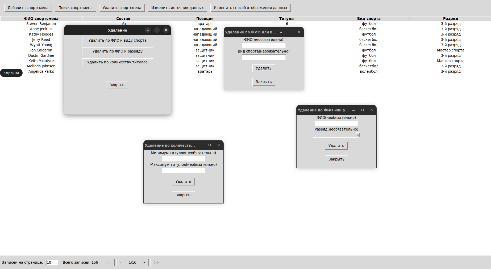

 Лабораторная работа №2 (Вариант 7)

В рамках лабораторной работы №2 было разработано приложение, предназначенное для управления списком спортсменов.

Цель проделанной работы:
- Изучить принципы построения графического пользовательского интерфейса
- Разработать программную систему с графическим пользовательским интерфейсом на языке Python

## Задание

Разработать оконное приложение с одним главным окном и несколькими дочерними диалогами. Вызов диалогов осуществляется через соответствующие пункты меню. Команды меню должны дублироваться на панели инструментов. 

## Структура данных 

## Реализация приложения 
### Приложение разработано с использованием шаблона MVC и включает в себя 3 модуля:
#### Model:
+ В базе данных используется SQLAlchemy для удобного обращения к базе данных
+ Все операции над БД вынесены в файл crud.py
+ Файл xmlAdapter.py отвечает за работу с XML файлами, как альтернативой БД

#### View:
+ Отдельные операции создания интерфейса для добавления, удаления, поиска вынесены в отдельные файлы  
+ Главное окно создается с помощью файла viewGUI.py
+ У поиска для большей модульности добавлен свой файл searchView.py

### Controller:
+ controller.py отвечает за валидацию значений поступающих в программу и логику всех операций в ней выполняющуюся 
+ searchController.py отвечает за действия с пагинацией в окне найденных элементов 

## Демонстрация некоторых функций приложения
+ Пользователь запускает программу
+ По умолчанию источником данных является база данных, количество элементов на страницу - 10

+ Пользователь может изменить источник данных 

+ Пользователь может изменить способ отображения данных

+ Пользователь может добавить данные

+ Пользователь может найти данные 3 способами

+ Пользователь может удалить данные 3 способами

## Вывод
Было разработано приложение с графическим интерфейсом, которое сохраняет свои данные в БД или XML файл, загружает их и выполняет любые базовые действия над ними. Были добавлены разные графические представления данных - в виде таблицы и в виде дерева 

